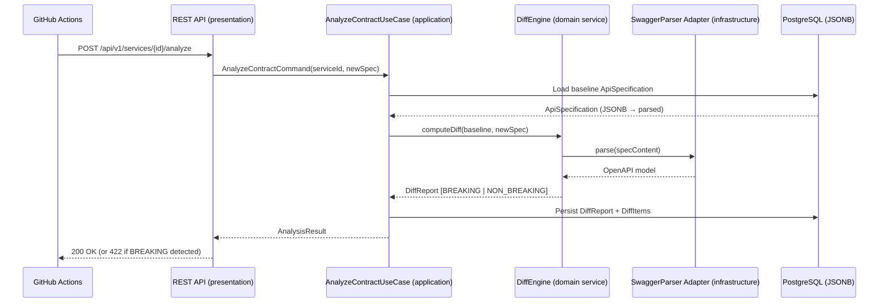
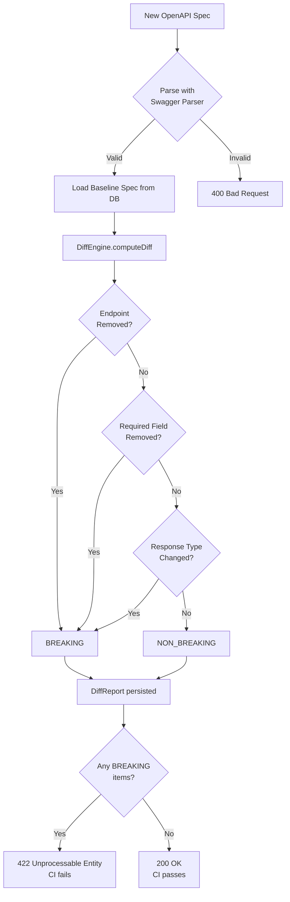
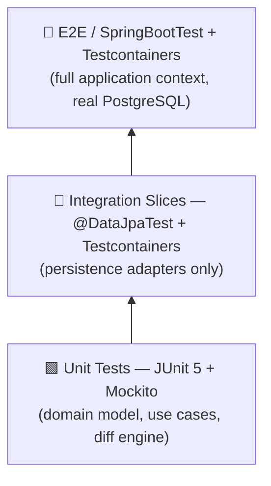
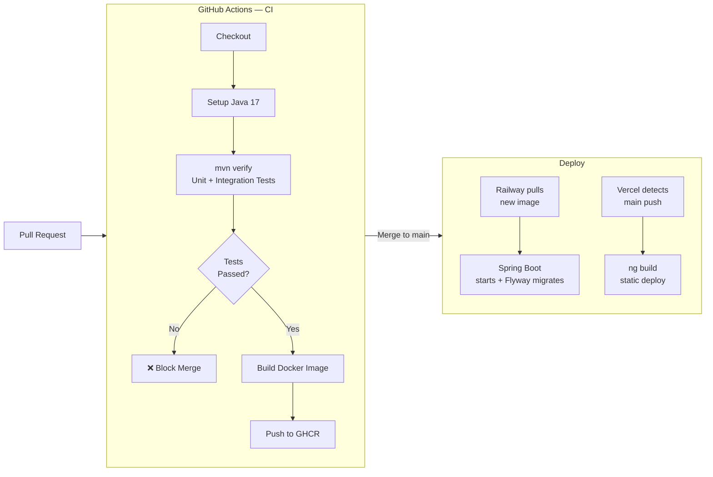

# ContractGuard 🛡️

> **Stop breaking changes before they break your users.**
> ContractGuard automatically detects and classifies every OpenAPI contract change as `BREAKING` or `NON_BREAKING`, failing your CI pipeline before the damage reaches production.

[](https://openjdk.org/projects/jdk/17/)
[](https://spring.io/projects/spring-boot)
[](https://angular.dev/)
[](https://www.postgresql.org/)
[](https://github.com/features/actions)
[](./LICENSE)

---

## Table of Contents

- [The Problem](#the-problem)
- [Architecture Overview](#architecture-overview)
- [Request Flow](#request-flow)
- [Technology Stack](#technology-stack)
- [Architecture Decision Records (ADRs)](#architecture-decision-records-adrs)
- [Project Structure](#project-structure)
- [Running Locally](#running-locally)
- [Environment Configuration](#environment-configuration)
- [API Reference](#api-reference)
- [Testing Strategy](#testing-strategy)
- [CI/CD Pipeline](#cicd-pipeline)

---

## The Problem

Modern microservice teams ship fast — and API contracts break silently. A required field gets removed, a response type changes, an endpoint gets renamed. The downstream consumers only find out when their service crashes in production.

**ContractGuard solves this at the source**: by integrating into the PR review cycle via GitHub Actions, it compares the new OpenAPI spec against the registered baseline and **blocks the merge** if any breaking change is detected.

---

## Architecture Overview

ContractGuard is built on **Clean Architecture** (Uncle Bob) with **Domain-Driven Design** principles. The dependency rule is enforced strictly: source code dependencies always point **inward**, toward the domain.

```
┌──────────────────────────────────────────────────────────────────────┐
│                           presentation                               │
│           REST Controllers · Request/Response DTOs · MapStruct       │
│  ┌────────────────────────────────────────────────────────────────┐  │
│  │                         application                            │  │
│  │             Use Cases (Interactors) · Commands · Queries       │  │
│  │  ┌──────────────────────────────────────────────────────────┐  │  │
│  │  │                       domain                             │  │  │
│  │  │     Aggregates · Value Objects · Domain Services         │  │  │
│  │  │     Ports (in/out) · Domain Exceptions                   │  │  │
│  │  │          (zero external dependencies)                    │  │  │
│  │  └──────────────────────────────────────────────────────────┘  │  │
│  └────────────────────────────────────────────────────────────────┘  │
│                         infrastructure                               │
│         JPA Adapters · Flyway · Swagger Parser Adapter · Config      │
└──────────────────────────────────────────────────────────────────────┘
```

### Layer Dependency Matrix

| Layer | May depend on | Must NOT depend on |
|---|---|---|
| `domain` | Pure Java + Lombok | Spring, JPA, any framework |
| `application` | `domain` | `infrastructure`, `presentation` |
| `infrastructure` | `domain`, `application`, Spring, JPA | `presentation` |
| `presentation` | `application`, `domain` (VOs/exceptions) | `infrastructure` directly |

---

## Request Flow

The following diagram illustrates the complete lifecycle of a contract analysis request, from the GitHub Actions webhook to the database and back.



### Breaking Change Classification Flow



---

## Technology Stack

| Layer | Technology | Rationale |
|---|---|---|
| Language | Java 17 | Records, sealed classes, pattern matching — expressive domain modeling |
| Framework | Spring Boot 3.2 | Production-grade auto-configuration; native GraalVM ready |
| ORM / Migrations | Spring Data JPA + Flyway | Type-safe queries; versioned schema evolution |
| Database | PostgreSQL 16 | JSONB for spec storage; GIN indexes; ACID guarantees |
| OpenAPI Parsing | Swagger Parser 2.1.x | Official SmartBear library; full OpenAPI 3.x + Swagger 2.x support |
| Mapping | MapStruct 1.5 | Compile-time, zero-reflection DTO mapping |
| Documentation | SpringDoc OpenAPI | Auto-generated, always-accurate Swagger UI |
| Testing | JUnit 5 + Mockito + Testcontainers | Real PostgreSQL in tests; no H2 fakes |
| Frontend | Angular 17 | Standalone components; reactive forms; Signals |
| CI/CD | GitHub Actions | Native Maven caching; Docker layer caching |
| Deploy | Railway (backend) + Vercel (frontend) | Zero-config PaaS; automatic HTTPS |

---

## Architecture Decision Records (ADRs)

These are abbreviated summaries. Full ADRs live in [`CLAUDE.md`](./CLAUDE.md#4-architecture-decision-records-adrs).

### ADR-001 — Static Analysis over Consumer-Driven Contracts (Pact)

**Decision:** Use static OpenAPI diff analysis as the primary breaking-change detection mechanism.

**Why not Pact?** Consumer-Driven Contracts require all consumers to adopt Pact and maintain their contracts. This is a high organizational adoption cost. Static analysis works on specs that teams already maintain, making it **zero-friction to adopt**.

**Trade-off accepted:** Quality depends on spec accuracy. Mitigation: validate the spec at registration time and fail loudly on malformed inputs.

---

### ADR-002 — OpenAPI Specs stored as JSONB in PostgreSQL

**Decision:** Store raw spec content as `JSONB` column in PostgreSQL rather than an external object store (S3/MinIO).

**Why JSONB?**
- Keeps the infrastructure footprint minimal — one dependency (PostgreSQL) instead of two.
- Native JSON operators (`->`, `->>`, `@>`) enable querying inside specs without loading the entire document.
- GIN indexes allow efficient path-based searches across all stored versions.
- PostgreSQL's TOAST compression handles large specs transparently.

**Trade-off accepted:** Hard coupling to PostgreSQL. Accepted by design — MySQL/H2 are not supported targets.

---

### ADR-003 — Custom Diff Engine over `openapi-diff` Library

**Decision:** Build a domain-owned `DiffEngine` that uses `swagger-parser` purely for parsing/deserialization, while implementing all comparison logic internally.

**Why custom?**
- Breaking-change classification rules are the **core business logic** of ContractGuard. Delegating them to a third-party library would invert the domain dependency.
- `openapi-diff` (OpenAPITools) has known edge cases and classifies some non-breaking changes (e.g., adding optional fields) as breaking — diverging from industry consensus.
- An internal engine is 100% unit-testable with pure JUnit without mocking complex library internals.
- New classification rules (custom `x-*` extensions, security scheme changes) can be added by any team member without waiting for upstream PRs.

---

## Project Structure

```
contractguard/
├── .github/
│   └── workflows/          # CI pipeline (build, test, Docker publish)
├── frontend/               # Angular 17 SPA
│   └── src/
│       ├── app/            # Feature modules and standalone components
│       └── environments/   # environment.ts (prod) | environment.development.ts
├── src/
│   └── main/
│       ├── java/br/com/contractguard/
│       │   ├── domain/
│       │   │   ├── model/          # Aggregates, Entities, Value Objects (pure Java)
│       │   │   ├── service/        # Domain Services (multi-aggregate logic)
│       │   │   ├── port/in/        # Input Ports (use case interfaces)
│       │   │   ├── port/out/       # Output Ports (repository/gateway interfaces)
│       │   │   └── exception/      # Domain-specific exceptions
│       │   ├── application/
│       │   │   ├── usecase/        # Use Case implementations (interactors)
│       │   │   ├── command/        # Write-side command objects
│       │   │   └── query/          # Read-side query objects
│       │   ├── infrastructure/
│       │   │   ├── persistence/
│       │   │   │   ├── entity/     # JPA @Entity classes (never in domain)
│       │   │   │   ├── repository/ # Spring Data JPA interfaces
│       │   │   │   └── adapter/    # Output Port implementations
│       │   │   ├── diff/           # Swagger Parser adapter (DiffEngine infra side)
│       │   │   └── config/         # Spring @Configuration beans (WebConfig, etc.)
│       │   └── presentation/
│       │       ├── controller/     # @RestController classes
│       │       ├── request/        # HTTP request DTOs
│       │       ├── response/       # HTTP response DTOs
│       │       └── mapper/         # MapStruct mappers
│       └── resources/
│           ├── application.yml         # Base configuration
│           ├── application-local.yml   # Local dev overrides
│           └── db/migration/           # Flyway versioned SQL scripts
├── Dockerfile              # Multi-stage build (Maven → JRE Alpine)
├── docker-compose.yml      # PostgreSQL 16 for local development
└── pom.xml
```

---

## Running Locally

### Prerequisites

| Tool | Minimum Version |
|---|---|
| Java (JDK) | 17 |
| Maven | 3.9 |
| Docker + Docker Compose | 24.x |
| Node.js | 18 LTS (frontend only) |

### Step 1 — Start PostgreSQL

```bash
docker-compose up -d
```

This starts a PostgreSQL 16 container with:
- **Host:** `localhost:5432`
- **Database:** `contractguard`
- **Credentials:** `contractguard / contractguard`
- **Data persistence:** named volume `contractguard-pgdata`

### Step 2 — Run the Backend

```bash
./mvnw spring-boot:run -Dspring-boot.run.profiles=local
```

The Spring Boot application starts on `http://localhost:8080`. Flyway migrations run automatically on startup.

### Step 3 — Run the Frontend (optional)

```bash
cd frontend
npm install
npm run start
```

The Angular dev server starts on `http://localhost:4200` with hot-reload enabled.

### Step 4 — Explore the API

| Interface | URL |
|---|---|
| Swagger UI | http://localhost:8080/swagger-ui.html |
| OpenAPI JSON | http://localhost:8080/v3/api-docs |
| Health Check | http://localhost:8080/actuator/health |

### Step 5 — Run Tests

```bash
# Unit tests (domain + application — no Docker needed)
mvn test

# Full suite including integration tests (requires Docker for Testcontainers)
mvn verify
```

---

## Environment Configuration

### Backend (`application.yml`)

All production secrets are injected via environment variables. The table below documents every overridable property:

| Environment Variable | Default (local) | Description |
|---|---|---|
| `SPRING_DATASOURCE_URL` | `jdbc:postgresql://localhost:5432/contractguard` | PostgreSQL JDBC URL |
| `SPRING_DATASOURCE_USERNAME` | `contractguard` | Database username |
| `SPRING_DATASOURCE_PASSWORD` | `contractguard` | Database password |
| `CORS_ALLOWED_ORIGINS` | `http://localhost:4200` | Comma-separated list of allowed CORS origins |
| `SERVER_PORT` | `8080` | HTTP port |

**Railway deployment example:**

```
SPRING_DATASOURCE_URL=jdbc:postgresql://<host>:<port>/<db>
SPRING_DATASOURCE_USERNAME=<user>
SPRING_DATASOURCE_PASSWORD=<secret>
CORS_ALLOWED_ORIGINS=https://contractguard.vercel.app
```

### Frontend (`src/environments/`)

| File | Used when | `apiUrl` |
|---|---|---|
| `environment.development.ts` | `ng serve` | `http://localhost:8080/api/v1` |
| `environment.ts` | `ng build` (production) | `''` (relative — proxied by Vercel) |

**Vercel deployment:** Set up a rewrite rule in `vercel.json` to proxy `/api/v1/*` to the Railway backend URL, keeping the frontend code free of hardcoded production URLs.

---

## API Reference

Full interactive documentation is available at `/swagger-ui.html`. Core endpoints:

| Method | Path | Description |
|---|---|---|
| `POST` | `/api/v1/services` | Register a new service |
| `GET` | `/api/v1/services` | List all registered services |
| `GET` | `/api/v1/services/{id}` | Get service details |
| `POST` | `/api/v1/services/{id}/specs` | Upload a new OpenAPI spec version |
| `POST` | `/api/v1/services/{id}/analyze` | Compare latest spec against baseline; returns diff report |
| `GET` | `/api/v1/services/{id}/reports` | List all analysis reports for a service |

---

## Testing Strategy

ContractGuard enforces a strict testing pyramid:



| Layer | Framework | Coverage Target |
|---|---|---|
| `domain/` | JUnit 5 (pure) | **100%** |
| `application/` | JUnit 5 + Mockito | ≥ 90% |
| `infrastructure/` | `@DataJpaTest` + Testcontainers | ≥ 70% |
| Full stack | `@SpringBootTest` + Testcontainers | Key user journeys |

**No H2, ever.** Integration tests use real PostgreSQL via Testcontainers to catch dialect-specific issues (JSONB operators, Flyway scripts) before they hit production.

---

## CI/CD Pipeline



The `CORS_ALLOWED_ORIGINS` environment variable set in Railway is the only coupling between the backend and frontend deployments — no code changes required when the frontend URL changes.

---

## License

Proprietary — All rights reserved © 2026.
